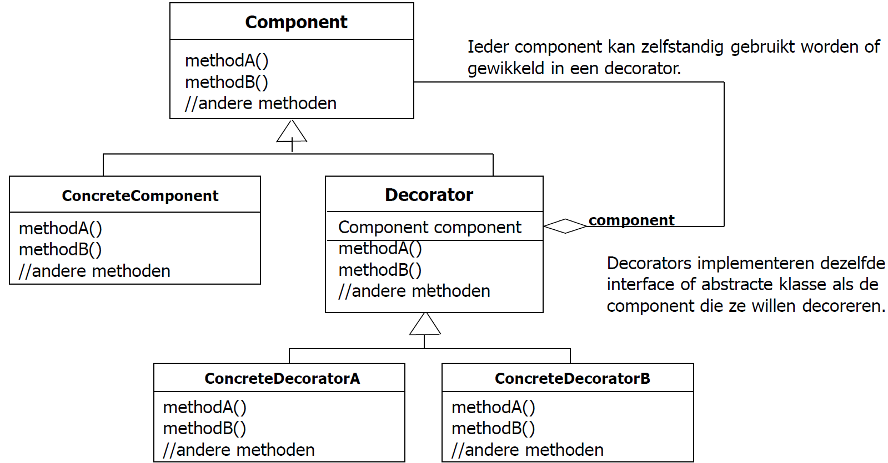
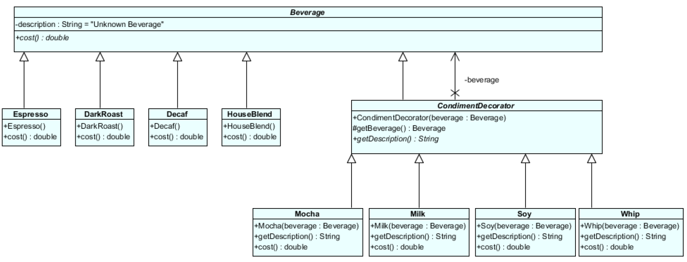

## [Decorator Pattern](https://www.youtube.com/watch?v=GCraGHx6gso&list=PLrhzvIcii6GNjpARdnO4ueTUAVR9eMBpc&index=3)

### Wat is het?

Het decorator pattern is een pattern dat je gebruikt om objecten dynamisch te kunnen uitbreiden. Het is een alternatief voor het gebruik van subklassen. Het decorator pattern is een structuur pattern.

### Voorbeeld

Je hebt een koffiezaak met allemaal soorten dranken(esspresso, decaf, chocomelk, icetea, cola). Je wilt bij sommige dranken misschien een extra toevoegen zoals bij koffie wat melk of suiker uiteraard ga je niet een nieuwe klasse maken voor elke combinatie van drank en extra. Je wilt dus een manier om de dranken dynamisch uit te breiden.

### Oplossing - Algemeen

1. Maak je hoofdklasse (component) met bepaalde methodes en variabelen.
2. Maak een abstracte decorator klasse die de hoofdklasse extend.
3. Maak een/meerdere concrete decorator klasse die de abstracte decorator klasse extend.
4. Maak een concreet object van de hoofdklasse (concrete component).
5. Maak een concreet object van de abstracte decorator klasse (concrete decorator) en geef het concreet object van de hoofdklasse mee als parameter.

   

### Voorbeeld Vervolg

> stappen komen overeen met de stappen in de algemene oplossing

1. ```java
   public abstract class Beverage {
         private String description = "Unknown Beverage";

         public String getDescription() {
               return description;
         }

         public abstract double cost();
   }
   ```

2. ```java
   public abstract class CondimentDecorator extends Beverage {
         private Beverage beverage;

         CondimentDecorator(Beverage beverage) {
               this.beverage = beverage;
         }

         protected Beverage getBeverage() {
               return beverage;
         }

         public abstract String getDescription();
   }
   ```

3. ```java
   public class Milk extends CondimentDecorator {
         Milk(Beverage beverage) {
               super(beverage);
         }

         @Override
         public String getDescription() {
               return getBeverage().getDescription() + ", Milk";
         }

         @Override
         public double cost() {
               return getBeverage().cost() + 0.10;
         }
   }
   ```

   ```java
   public class Sugar extends CondimentDecorator {
         Sugar(Beverage beverage) {
               super(beverage);
         }

         @Override
         public String getDescription() {
               return getBeverage().getDescription() + ", Sugar";
         }

         @Override
         public double cost() {
               return getBeverage().cost() + 0.05;
         }
   }
   ```

   ```java
   public class Whip extends CondimentDecorator {
         Whip(Beverage beverage) {
               super(beverage);
         }

         @Override
         public String getDescription() {
               return getBeverage().getDescription() + ", Whip";
         }

         @Override
         public double cost() {
               return getBeverage().cost() + 0.15;
         }
   }
   ```

4. ```java
   public class Espresso extends Beverage {
         Espresso() {
               super();
               super.description = "Espresso";
         }

         @Override
         public double cost() {
               return 1.99;
         }
   }
   ```

   ```java
   public class Decaf extends Beverage {
         Decaf() {
               super();
               super.description = "Decaf";
         }

         @Override
         public double cost() {
               return 1.05;
         }
   }
   ```

   ```java
   public class Tea extends Beverage {
         Tea() {
               super();
               super.description = "Tea";
         }

         @Override
         public double cost() {
               return 0.50;
         }
   }
   ```

   ```java
   public class HotChocolate extends Beverage {
         HotChocolate() {
               super();
               super.description = "Hot Chocolate";
         }

         @Override
         public double cost() {
               return 0.65;
         }
   }
   ```

5. ```java
   public class StarbuzzCoffee {
         public static void main(String[] args) {
               Beverage beverage = new Espresso();
               System.out.println(beverage.getDescription() + " $" + beverage.cost());

               //kan op deze mannier toevoegen van extras
               Beverage beverage2 = new Decaf();
               beverage2 = new Milk(beverage2);
               beverage2 = new Sugar(beverage2);
               beverage2 = new Whip(beverage2);
               System.out.println(beverage2.getDescription() + " $" + beverage2.cost());

               //of op deze manier
               Beverage beverage3 = new  Whip(Sugar(new Milk(new Tea())));
               System.out.println(beverage3.getDescription() + " $" + beverage3.cost());

               Beverage beverage4 = new HotChocolate();
               beverage4 = new Milk(beverage4);
               beverage4 = new Sugar(beverage4);
               beverage4 = new Whip(beverage4);
               System.out.println(beverage4.getDescription() + " $" + beverage4.cost());
         }
   }
   ```

   > output:
   >
   > ```
   > Espresso $1.99
   > Decaf, Milk, Sugar, Whip $1.4
   > Tea, Milk, Sugar, Whip $1.2
   > Hot Chocolate, Milk, Sugar, Whip $1.35
   > ```

   

# [TERUG NAAR INHOUDSOPGAVE](../README.md)
