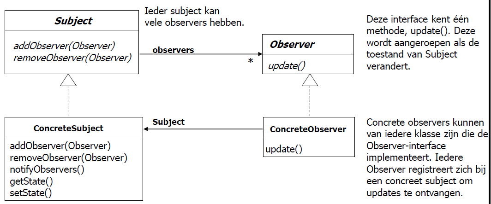

## [Observer Pattern](https://youtu.be/_BpmfnqjgzQ?list=PLrhzvIcii6GNjpARdnO4ueTUAVR9eMBpc)

### Probleem

In Observer Pattern definiëren we een een-op-veel relatie tussen objecten zodat wanneer een object verandert van staat, alle zijn afhankelijke objecten worden op de hoogte gebracht en automatisch bijgewerkt. Dit werkt door een Subject/Observable object te hebben dat een lijst bijhoudt van alle Observer objecten. Wanneer het Subject object verandert van staat, stuurt het een bericht naar alle Observer objecten in de lijst. Observer objecten kunnen zichzelf toevoegen of verwijderen bij het Subject object.

### Voorbeeld

Je hebt een weerstation. Je wilt dat de temperatuur, luchtvochtigheid en luchtdruk worden weergegeven op een scherm en je wilt ook dat de temperatuur, luchtvochtigheid en luchtdruk worden weergegeven op een app. Deze schermen moeten vanzelf geupdate worden wanneer de temperatuur, luchtvochtigheid en luchtdruk veranderen. Je wilt ook dat de app en het scherm niet afhankelijk zijn van elkaar. Je wilt dat je de app en het scherm kunt toevoegen zonder de code van het weerstation aan te hoeven passen.

### Oplossing - Algemeen

1. Maak een Subject/Observable interface met volgende methodes:
   - addObserver(Observer o)
   - removeObserver(Observer o)
   - notifyObservers()
2. Maak een concrete klasse die de Subject/Observable interface implementeert.
   - bijvoorbeeld: klasse WeatherData
3. Maak een Observer interface met volgende methode:
   - update()
4. Maak een concrete klasse die de Observer interface implementeert.
   - bijvoorbeeld: klasse CurrentConditionsDisplay



### Voorbeeld Vervolg

> stappen komen overeen met de stappen in de algemene oplossing

1. ```java
   public interface Subject {
        public void addObserver(Observer o);
        public void removeObserver(Observer o);
        public void notifyObservers();
   }
   ```
2. ```java
   public class WeatherData implements Subject {
        private Set<Observer> observers;
        private float temperature;
        private float humidity;
        private float pressure;

        public WeatherData() {
            observers = new HashSet<Observer>();//set omdat we dan geen dubbele observer objecten kunnen toevoegen
        }

        @Override
        public void addObserver(Observer o) {
            observers.add(o);
        }

        @Override
        public void removeObserver(Observer o) {
            observers.remove(i);

        }

        public void notifyObservers() {
            observers.forEach(o -> o.update(temperature, humidity, pressure));
        }

        public void setMeasurements(float temperature, float humidity, float pressure) {
            this.temperature = temperature;
            this.humidity = humidity;
            this.pressure = pressure;
            notifyObservers();
        }

        public float getTemperature() {
            return temperature;
        }

        public float getHumidity() {
            return humidity;
        }

        public float getPressure() {
            return pressure;
        }
   }
   ```

3. ```java
   public interface Observer {
         public void update(float temperature, float humidity, float pressure);
   }
   ```

4. ```java
   public class CurrentConditionsDisplay implements Observer {
         private float temperature;
         private float humidity;
         private float pressure;
         private Subject weatherData;

         public CurrentConditionsDisplay(Subject weatherData) {
               this.weatherData = weatherData;
               weatherData.addObserver(this);
         }

         @Override
         public void update(float temperature, float humidity, float pressure) {
               this.temperature = temperature;
               this.humidity = humidity;
               this.pressure = pressure;
               display();
         }

         public void display() {
               System.out.println("Current conditions: " + temperature + "F degrees and " + humidity + "% humidity");
         }
   }
   ```

> voorbeeld van mogelijke main klasse

5. ```java
   public class WeatherStation {
           public static void main(String[] args) {
               WeatherData weatherData = new WeatherData();
               CurrentConditionsDisplay currentConditionsDisplay = new CurrentConditionsDisplay(weatherData);
               weatherData.setMeasurements(80, 65, 30.4f);
               weatherData.setMeasurements(82, 70, 29.2f);
               weatherData.setMeasurements(78, 90, 29.2f);
           }
   }
   ```
   > output:
   >
   > ```
   > Current conditions: 80.0F degrees and 65.0% humidity
   > Current conditions: 82.0F degrees and 70.0% humidity
   > Current conditions: 78.0F degrees and 90.0% humidity
   > ```

# [TERUG NAAR INHOUDSOPGAVE](../README.md)
