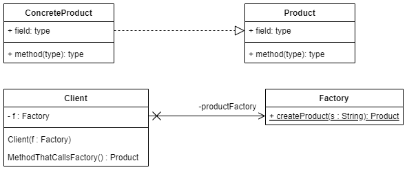
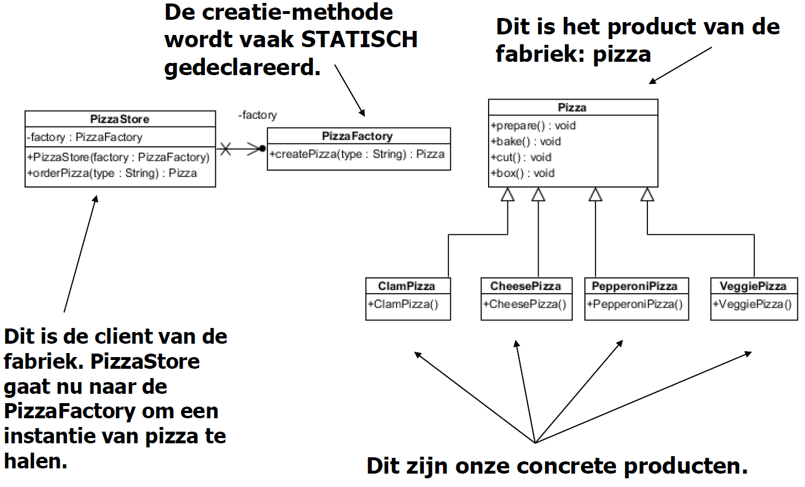

# Design Patterns ASD I

## [Strategy Pattern](https://youtu.be/v9ejT8FO-7I?list=PLrhzvIcii6GNjpARdnO4ueTUAVR9eMBpc)

### Probleem

We hebben een class die een bepaalde methode heeft. We willen de methode kunnen veranderen zonder de class te hoeven aanpassen. -> voor gevarieerd gedrag

### Voorbeeld

We hebben een class Duck die een methode quacken fly heeft. Maar er kunnen ook Duck's zijn die niet kunnen vliegen of niet kunnen kwaken. We willen de methode kunnen veranderen zonder de class Duck aan te hoeven passen.

### Oplossing - Algemeen

1. We maken een interface met een bepaald gedrag (behaviour/strategy).
2. We maken een specifieke klasse (concrete behaviour/strategy) die het gedrag implementeert.
3. We maken een klasse (client) die het gedrag implementeerd.
4. Methode injectie van het specifieke gedrag in de klasse die het gedrag implementeerd. (constructor of setter)
5. Mogelijke subklassen maken van de klasse die het gedrag implementeerd.

   

### Voorbeeld Vervolg - Enkel vliegen

> stappen komen overeen met de stappen in de algemene oplossing

1. ```java
   public interface FlyBehaviour {
       public String fly();
   }
   ```

2. ```java
    //voor een duck die kan vliegen
   public class FlyWithWings implements FlyBehaviour {
        public String fly() {
             return "I'm flying";
        }
   }
   //voor een duck die niet kan vliegen
   public class FlyNoWay implements FlyBehaviour {
        public String fly() {
             return "I can't fly";
        }
    }
   ```

3. ```java
   public class Duck implements FlyBehaviour {
        private FlyBehaviour flyBehaviour;

    }

   ```

4. ```java
   public class Duck implements FlyBehaviour{
        private FlyBehaviour flyBehaviour;

        // met constructorinjectie -> kies 1 van de 2
        public Duck(FlyBehaviour flyBehaviour) {
            this.flyBehaviour = flyBehaviour;
        }

        // met setterinjectie
        public void setFlyBehaviour(FlyBehaviour flyBehaviour) {
            this.flyBehaviour = flyBehaviour;
        }

        //Gedrag implementeren
        public String fly() {
            return flyBehaviour.fly();
        }

    }

   ```

5. ```java
    public class MallardDuck extends Duck {
          public MallardDuck() {
                flyBehaviour = new FlyWithWings();
          }
    }

    public class RubberDuck extends Duck {
          public RubberDuck() {
                flyBehaviour = new FlyNoWay();
          }
    }
   ```

   

---

## [Simple Factory Pattern](https://www.youtube.com/watch?v=ub0DXaeV6hA)

### Probleem

In Fabriekspatroon maken we een object zonder de creatielogica aan de klant bloot te stellen en verwijzen we naar een nieuw gemaakt object met behulp van een gemeenschappelijke interface.

"The factory design pattern is used when we have a superclass with multiple sub-classes and based on input, we need to return one of the sub-class. This pattern takes out the responsibility of the instantiation of a class from the client program to the factory class. "

### Voorbeeld

Je hebt een pizza winkel. Je hebt verschillende soorten pizza's. En je wilt nieuwe pizza's kunnen toevoegen zonder de code van de winkel aan te hoeven passen. We verbergen de creatielogica van de pizza's in een factory I.p.v. die logica in de winkel te zetten.

### Oplossing - Algemeen

1. Maak een hoofdklasse voor welk soort product dat je wilt maken.
   - bijvoorbeeld: klasse Pizza
2. Maak subklassen van de hoofdklasse.
   - bijvoorbeeld: subklassen van Pizza: Margherita, Pepperoni, ...
3. Maak een factory class met een (statische) methode die een object van een bepaalde class teruggeeft.
   - bijvoorbeeld: methode maakPizza() die een object van de klasse Pizza teruggeeft.
4. Maak een klasse (normaal de applicatie) die de factory klasse gebruikt om een object te maken en dus de maakPizza aanroept.
   - bijvoorbeeld: klasse PizzaStore die de factory klasse gebruikt om een object te maken en dus de maakPizza aanroept.



### Voorbeeld Vervolg

> stappen komen overeen met de stappen in de algemene oplossing

1. ```java
   public abstract class Pizza {
       public abstract String getName();
   }
   ```
2. ```java
   public class Margherita extends Pizza {
        public String getName() {
             return "Margherita";
        }
   }

   public class Pepperoni extends Pizza {
        public String getName() {
             return "Pepperoni";
        }
   }
   ```

3. ```java
   public class PizzaFactory {
        public static Pizza maakPizza(String type) {
             if (type.equals("Margherita")) {
               return  new Margherita();
             } else if (type.equals("Pepperoni")) {
               return new Pepperoni();
             }
             return null;
        }
   }
   ```

4. ```java
   public class PizzaStore {
        private PizzaFactory pizzaFactory;

        public PizzaStore(PizzaFactory pizzaFactory) {
             this.pizzaFactory = pizzaFactory;
        }

         public static void main(String[] args) {
                Pizza pizza = PizzaFactory.maakPizza("Margherita");
                System.out.println(pizza.getName());
         }
   }
   ```



> andere pizza soorten gebruikt dan uml

## Observer Pattern

### Probleem

### Voorbeeld

### Oplossing - Algemeen

### Voorbeeld Vervolg

---

## Decorator Pattern

### Probleem

### Voorbeeld

### Oplossing - Algemeen

### Voorbeeld Vervolg

---

## State Pattern

### Probleem

### Voorbeeld

### Oplossing - Algemeen

### Voorbeeld Vervolg

---

## Facade Pattern

### Probleem

### Voorbeeld

### Oplossing - Algemeen

### Voorbeeld Vervolg

---

## MVC (Pattern)

### Probleem

### Voorbeeld

### Oplossing - Algemeen

### Voorbeeld Vervolg²
