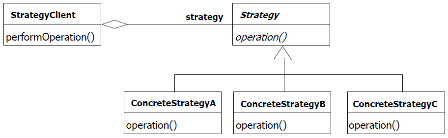
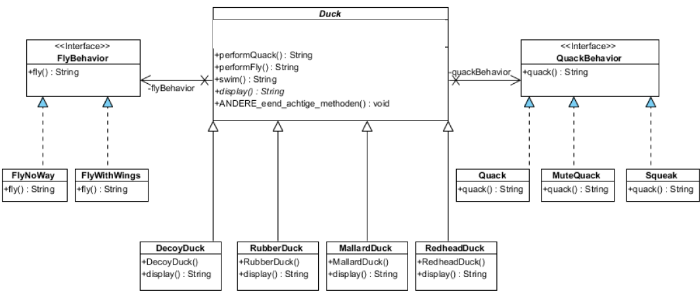
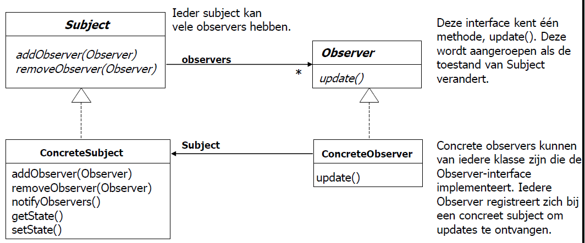
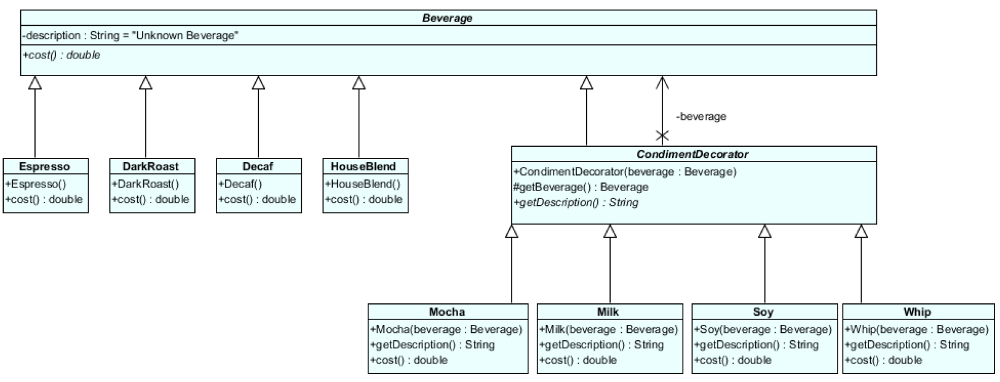
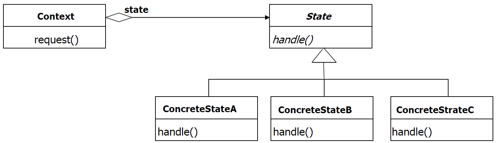

# Design Patterns ASD I

## [Strategy Pattern](https://youtu.be/v9ejT8FO-7I?list=PLrhzvIcii6GNjpARdnO4ueTUAVR9eMBpc)

### Probleem

We hebben een class die een bepaalde methode heeft. We willen de methode kunnen veranderen zonder de class te hoeven aanpassen. -> voor gevarieerd gedrag

### Voorbeeld

We hebben een class Duck die een methode quacken fly heeft. Maar er kunnen ook Duck's zijn die niet kunnen vliegen of niet kunnen kwaken. We willen de methode kunnen veranderen zonder de class Duck aan te hoeven passen.

### Oplossing - Algemeen

1. We maken een interface met een bepaald gedrag (behaviour/strategy).
2. We maken een specifieke klasse (concrete behaviour/strategy) die het gedrag implementeert.
3. We maken een klasse (client) die het gedrag implementeerd.
4. Methode injectie van het specifieke gedrag in de klasse die het gedrag implementeerd. (constructor of setter)
5. Mogelijke subklassen maken van de klasse die het gedrag implementeerd.

   

### Voorbeeld Vervolg - Enkel vliegen

> stappen komen overeen met de stappen in de algemene oplossing

1. ```java
   public interface FlyBehaviour {
       public String fly();
   }
   ```

2. ```java
    //voor een duck die kan vliegen
   public class FlyWithWings implements FlyBehaviour {
        public String fly() {
             return "I'm flying";
        }
   }
   //voor een duck die niet kan vliegen
   public class FlyNoWay implements FlyBehaviour {
        public String fly() {
             return "I can't fly";
        }
    }
   ```

3. ```java
   public class Duck implements FlyBehaviour {
        private FlyBehaviour flyBehaviour;

    }

   ```

4. ```java
   public class Duck implements FlyBehaviour{
        private FlyBehaviour flyBehaviour;

        // met constructorinjectie -> kies 1 van de 2
        public Duck(FlyBehaviour flyBehaviour) {
            this.flyBehaviour = flyBehaviour;
        }

        // met setterinjectie
        public void setFlyBehaviour(FlyBehaviour flyBehaviour) {
            this.flyBehaviour = flyBehaviour;
        }

        //Gedrag implementeren
        public String fly() {
            return flyBehaviour.fly();
        }

    }

   ```

5. ```java
    public class MallardDuck extends Duck {
          public MallardDuck() {
                flyBehaviour = new FlyWithWings();
          }
    }

    public class RubberDuck extends Duck {
          public RubberDuck() {
                flyBehaviour = new FlyNoWay();
          }
    }
   ```

   

---

## [Simple Factory Pattern](https://www.youtube.com/watch?v=ub0DXaeV6hA)

### Probleem

In Fabriekspatroon maken we een object zonder de creatielogica aan de klant bloot te stellen en verwijzen we naar een nieuw gemaakt object met behulp van een gemeenschappelijke interface.

"The factory design pattern is used when we have a superclass with multiple sub-classes and based on input, we need to return one of the sub-class. This pattern takes out the responsibility of the instantiation of a class from the client program to the factory class. "

### Voorbeeld

Je hebt een pizza winkel. Je hebt verschillende soorten pizza's. En je wilt nieuwe pizza's kunnen toevoegen zonder de code van de winkel aan te hoeven passen. We verbergen de creatielogica van de pizza's in een factory I.p.v. die logica in de winkel te zetten.

### Oplossing - Algemeen

1. Maak een hoofdklasse voor welk soort product dat je wilt maken.
   - bijvoorbeeld: klasse Pizza
2. Maak subklassen van de hoofdklasse.
   - bijvoorbeeld: subklassen van Pizza: Margherita, Pepperoni, ...
3. Maak een factory class met een (statische) methode die een object van een bepaalde class teruggeeft.
   - bijvoorbeeld: methode maakPizza() die een object van de klasse Pizza teruggeeft.
4. Maak een klasse (normaal de applicatie) die de factory klasse gebruikt om een object te maken en dus de maakPizza aanroept.
   - bijvoorbeeld: klasse PizzaStore die de factory klasse gebruikt om een object te maken en dus de maakPizza aanroept.


### Voorbeeld Vervolg

> stappen komen overeen met de stappen in de algemene oplossing

1. ```java
   public abstract class Pizza {
       public abstract String getName();
   }
   ```
2. ```java
   public class Margherita extends Pizza {
        public String getName() {
             return "Margherita";
        }
   }

   public class Pepperoni extends Pizza {
        public String getName() {
             return "Pepperoni";
        }
   }
   ```

3. ```java
   public class PizzaFactory {
        public static Pizza maakPizza(String type) {
             if (type.equals("Margherita")) {
               return  new Margherita();
             } else if (type.equals("Pepperoni")) {
               return new Pepperoni();
             }
             return null;
        }
   }
   ```

4. ```java
   public class PizzaStore {
        private PizzaFactory pizzaFactory;

        public PizzaStore(PizzaFactory pizzaFactory) {
             this.pizzaFactory = pizzaFactory;
        }

         public static void main(String[] args) {
                Pizza pizza = PizzaFactory.maakPizza("Margherita");
                System.out.println(pizza.getName());
         }
   }
   ```


> andere pizza soorten gebruikt dan uml

---

## [Observer Pattern](https://youtu.be/_BpmfnqjgzQ?list=PLrhzvIcii6GNjpARdnO4ueTUAVR9eMBpc)

### Probleem

In Observer Pattern definiëren we een een-op-veel relatie tussen objecten zodat wanneer een object verandert van staat, alle zijn afhankelijke objecten worden op de hoogte gebracht en automatisch bijgewerkt. Dit werkt door een Subject/Observable object te hebben dat een lijst bijhoudt van alle Observer objecten. Wanneer het Subject object verandert van staat, stuurt het een bericht naar alle Observer objecten in de lijst. Observer objecten kunnen zichzelf toevoegen of verwijderen bij het Subject object.

### Voorbeeld

Je hebt een weerstation. Je wilt dat de temperatuur, luchtvochtigheid en luchtdruk worden weergegeven op een scherm en je wilt ook dat de temperatuur, luchtvochtigheid en luchtdruk worden weergegeven op een app. Deze schermen moeten vanzelf geupdate worden wanneer de temperatuur, luchtvochtigheid en luchtdruk veranderen. Je wilt ook dat de app en het scherm niet afhankelijk zijn van elkaar. Je wilt dat je de app en het scherm kunt toevoegen zonder de code van het weerstation aan te hoeven passen.

### Oplossing - Algemeen

1. Maak een Subject/Observable interface met volgende methodes:
   - addObserver(Observer o)
   - removeObserver(Observer o)
   - notifyObservers()
2. Maak een concrete klasse die de Subject/Observable interface implementeert.
   - bijvoorbeeld: klasse WeatherData
3. Maak een Observer interface met volgende methode:
   - update()
4. Maak een concrete klasse die de Observer interface implementeert.
   - bijvoorbeeld: klasse CurrentConditionsDisplay



### Voorbeeld Vervolg

> stappen komen overeen met de stappen in de algemene oplossing

1. ```java
   public interface Subject {
        public void addObserver(Observer o);
        public void removeObserver(Observer o);
        public void notifyObservers();
   }
   ```
2. ```java
   public class WeatherData implements Subject {
        private Set<Observer> observers;
        private float temperature;
        private float humidity;
        private float pressure;

        public WeatherData() {
            observers = new HashSet<Observer>();//set omdat we dan geen dubbele observer objecten kunnen toevoegen
        }

        @Override
        public void addObserver(Observer o) {
            observers.add(o);
        }

        @Override
        public void removeObserver(Observer o) {
            observers.remove(i);

        }

        public void notifyObservers() {
            observers.forEach(o -> o.update(temperature, humidity, pressure));
        }

        public void setMeasurements(float temperature, float humidity, float pressure) {
            this.temperature = temperature;
            this.humidity = humidity;
            this.pressure = pressure;
            notifyObservers();
        }

        public float getTemperature() {
            return temperature;
        }

        public float getHumidity() {
            return humidity;
        }

        public float getPressure() {
            return pressure;
        }
   }
   ```

3. ```java
   public interface Observer {
         public void update(float temperature, float humidity, float pressure);
   }
   ```

4. ```java
   public class CurrentConditionsDisplay implements Observer {
         private float temperature;
         private float humidity;
         private float pressure;
         private Subject weatherData;

         public CurrentConditionsDisplay(Subject weatherData) {
               this.weatherData = weatherData;
               weatherData.addObserver(this);
         }

         @Override
         public void update(float temperature, float humidity, float pressure) {
               this.temperature = temperature;
               this.humidity = humidity;
               this.pressure = pressure;
               display();
         }

         public void display() {
               System.out.println("Current conditions: " + temperature + "F degrees and " + humidity + "% humidity");
         }
   }
   ```

> voorbeeld van mogelijke main klasse

5. ```java
   public class WeatherStation {
           public static void main(String[] args) {
               WeatherData weatherData = new WeatherData();
               CurrentConditionsDisplay currentConditionsDisplay = new CurrentConditionsDisplay(weatherData);
               weatherData.setMeasurements(80, 65, 30.4f);
               weatherData.setMeasurements(82, 70, 29.2f);
               weatherData.setMeasurements(78, 90, 29.2f);
           }
   }
   ```
   > output:
   >
   > ```
   > Current conditions: 80.0F degrees and 65.0% humidity
   > Current conditions: 82.0F degrees and 70.0% humidity
   > Current conditions: 78.0F degrees and 90.0% humidity
   > ```

---

## [Decorator Pattern](https://www.youtube.com/watch?v=GCraGHx6gso&list=PLrhzvIcii6GNjpARdnO4ueTUAVR9eMBpc&index=3)

### Wat is het?

Het decorator pattern is een pattern dat je gebruikt om objecten dynamisch te kunnen uitbreiden. Het is een alternatief voor het gebruik van subklassen. Het decorator pattern is een structuur pattern.

### Voorbeeld

Je hebt een koffiezaak met allemaal soorten dranken(esspresso, decaf, chocomelk, icetea, cola). Je wilt bij sommige dranken misschien een extra toevoegen zoals bij koffie wat melk of suiker uiteraard ga je niet een nieuwe klasse maken voor elke combinatie van drank en extra. Je wilt dus een manier om de dranken dynamisch uit te breiden.

### Oplossing - Algemeen

1. Maak je hoofdklasse (component) met bepaalde methodes en variabelen.
2. Maak een abstracte decorator klasse die de hoofdklasse extend.
3. Maak een/meerdere concrete decorator klasse die de abstracte decorator klasse extend.
4. Maak een concreet object van de hoofdklasse (concrete component).
5. Maak een concreet object van de abstracte decorator klasse (concrete decorator) en geef het concreet object van de hoofdklasse mee als parameter.

   

### Voorbeeld Vervolg

> stappen komen overeen met de stappen in de algemene oplossing

1. ```java
   public abstract class Beverage {
         private String description = "Unknown Beverage";

         public String getDescription() {
               return description;
         }

         public abstract double cost();
   }
   ```

2. ```java
   public abstract class CondimentDecorator extends Beverage {
         private Beverage beverage;

         CondimentDecorator(Beverage beverage) {
               this.beverage = beverage;
         }

         protected Beverage getBeverage() {
               return beverage;
         }

         public abstract String getDescription();
   }
   ```

3. ```java
   public class Milk extends CondimentDecorator {
         Milk(Beverage beverage) {
               super(beverage);
         }

         @Override
         public String getDescription() {
               return getBeverage().getDescription() + ", Milk";
         }

         @Override
         public double cost() {
               return getBeverage().cost() + 0.10;
         }
   }
   ```

   ```java
   public class Sugar extends CondimentDecorator {
         Sugar(Beverage beverage) {
               super(beverage);
         }

         @Override
         public String getDescription() {
               return getBeverage().getDescription() + ", Sugar";
         }

         @Override
         public double cost() {
               return getBeverage().cost() + 0.05;
         }
   }
   ```

   ```java
   public class Whip extends CondimentDecorator {
         Whip(Beverage beverage) {
               super(beverage);
         }

         @Override
         public String getDescription() {
               return getBeverage().getDescription() + ", Whip";
         }

         @Override
         public double cost() {
               return getBeverage().cost() + 0.15;
         }
   }
   ```

4. ```java
   public class Espresso extends Beverage {
         Espresso() {
               super();
               super.description = "Espresso";
         }

         @Override
         public double cost() {
               return 1.99;
         }
   }
   ```

   ```java
   public class Decaf extends Beverage {
         Decaf() {
               super();
               super.description = "Decaf";
         }

         @Override
         public double cost() {
               return 1.05;
         }
   }
   ```

   ```java
   public class Tea extends Beverage {
         Tea() {
               super();
               super.description = "Tea";
         }

         @Override
         public double cost() {
               return 0.50;
         }
   }
   ```

   ```java
   public class HotChocolate extends Beverage {
         HotChocolate() {
               super();
               super.description = "Hot Chocolate";
         }

         @Override
         public double cost() {
               return 0.65;
         }
   }
   ```

5. ```java
   public class StarbuzzCoffee {
         public static void main(String[] args) {
               Beverage beverage = new Espresso();
               System.out.println(beverage.getDescription() + " $" + beverage.cost());

               //kan op deze mannier toevoegen van extras
               Beverage beverage2 = new Decaf();
               beverage2 = new Milk(beverage2);
               beverage2 = new Sugar(beverage2);
               beverage2 = new Whip(beverage2);
               System.out.println(beverage2.getDescription() + " $" + beverage2.cost());

               //of op deze manier
               Beverage beverage3 = new  Whip(Sugar(new Milk(new Tea())));
               System.out.println(beverage3.getDescription() + " $" + beverage3.cost());

               Beverage beverage4 = new HotChocolate();
               beverage4 = new Milk(beverage4);
               beverage4 = new Sugar(beverage4);
               beverage4 = new Whip(beverage4);
               System.out.println(beverage4.getDescription() + " $" + beverage4.cost());
         }
   }
   ```

   > output:
   >
   > ```
   > Espresso $1.99
   > Decaf, Milk, Sugar, Whip $1.4
   > Tea, Milk, Sugar, Whip $1.2
   > Hot Chocolate, Milk, Sugar, Whip $1.35
   > ```

   

---

## [State Pattern](https://www.youtube.com/watch?v=N12L5D78MAA&list=PLrhzvIcii6GNjpARdnO4ueTUAVR9eMBpc&index=17)

### Wat is het?

Het state pattern is een gedragspatroon. Het is een patroon dat de interne state van een object verandert. Het object zal gedrag vertonen dat afhankelijk is van de state waarin het zich bevindt. Het state pattern is een alternatief voor het gebruik van if-else statements..

"Het State Pattern maakt het voor een object mogelijk zijn gedrag te veranderen wanneer zijn interne toestand verandert. Het object lijkt van klasse te veranderen."

### Voorbeeld

Een voorbeeld van een state pattern is een automaat. Een automaat kan verschillende states hebben. Bijvoorbeeld: geen geld, wel geld, koffie aan het maken, koffie klaar. De automaat zal gedrag vertonen dat afhankelijk is van de state waarin hij zich bevindt. Je kan geen koffie maken als er al een andere koffie wordt gemaakt enzovoort. Dit willen we oplossen met het state pattern.

### Oplossing - Algemeen

1.  Maak een context klasse die states nodig heeft. Deze klasse zal de state bijhouden en de state methodes aanroepen.
    - bijvoorbeeld: KoffieAutomaat
2.  Maak een abstracte state klasse. Deze klasse zal de methodes bevatten die de context klasse nodig heeft. Deze methodes zullen de state veranderen.
    - bijvoorbeeld: AutomaatState
3.  Maak een/meerdere concrete state klasse voor elke state die de context klasse kan hebben. Deze klasse zal de methodes van de abstracte state klasse implementeren. Deze methodes zullen de huidige state veranderen als dat nodig is.
    - bijvoorbeeld: GeenMuntState, MuntState, KoffieMakenState, KoffieKlaarState



### Voorbeeld Vervolg

> stappen komen overeen met de stappen in de algemene oplossing

1.  ```java
    public class KoffieAutomaat {
          private AutomaatState state;

          public KoffieAutomaat() {
                state = new GeenGeldState(this);
          }

          public void setState(AutomaatState state) {
                this.state = state;
          }

          public void insertCoin() {
                state.insertCoin();
          }

          public void pushButton() {
                state.pushButton();
          }

          public void takeCup() {
                state.takeCup();
          }
    }
    ```

2.  ```java
      public abstract class AutomaatState {
            protected KoffieAutomaat automaat;

            public AutomaatState(KoffieAutomaat automaat) {
                  this.automaat = automaat;
            }

            public abstract void insertCoin();
            public abstract void pushButton();
            public abstract void takeCup();
      }
    ```

3.  ```java
      public class GeenGeldState extends AutomaatState {
            public GeenGeldState(KoffieAutomaat automaat) {
                  super(automaat);
            }

            @Override
            public void insertCoin() {
                  System.out.println("
                  Geld is ingevoerd");
                  automaat.setState(new GeldState(automaat));
            }

            @Override
            public void pushButton() {
                  System.out.println("Geen geld ingevoerd");
            }

            @Override
            public void takeCup() {
                  System.out.println("Geen geld ingevoerd");
            }
      }
    ```

    ```java
       public class GeldState extends AutomaatState {
       public GeldState(KoffieAutomaat automaat) {
       super(automaat);
       }

                @Override
                public void insertCoin() {
                      System.out.println("Geld is al ingevoerd");
                }

                @Override
                public void pushButton() {
                      System.out.println("Koffie wordt gemaakt");
                      automaat.setState(new KoffieMakenState(automaat));
                }

                @Override
                public void takeCup() {
                      System.out.println("Koffie is nog niet klaar");
                }

       }

    ```

    ```java
    public class KoffieMakenState extends AutomaatState {
      public KoffieMakenState(KoffieAutomaat automaat) {
         super(automaat);
      }

      @Override
      public void insertCoin() {
         System.out.println("Koffie wordt reeds gemaakt");
      }

      @Override
      public void pushButton() {
         System.out.println("Koffie wordt gemaakt");
         automaat.setState(new KoffieKlaarState(automaat));
      }

      @Override
      public void takeCup() {
         System.out.println("Koffie wordt gemaakt wacht tot hij klaar is");
      }
    }
    ```

    ```java

    public class KoffieKlaarState extends AutomaatState {
      public KoffieKlaarState(KoffieAutomaat automaat) {
         super(automaat);
      }

      @Override
      public void insertCoin() {
         System.out.println("Koffie is klaar neem je geld terug");
      }

      @Override
      public void pushButton() {
         System.out.println("Koffie is klaar neem je geld terug");
      }

      @Override
      public void takeCup() {
         System.out.println("Koffie is klaar");
         automaat.setState(new GeenGeldState(automaat));
      }

    }

    ```

    ```java
    public class Main {
      public static void main(String[] args) {
         KoffieAutomaat automaat = new KoffieAutomaat();
         automaat.insertCoin();
         automaat.pushButton();
         automaat.takeCup();
      }
    }
    ```

> Andere UML zelfde principe
> 

---

## Facade Pattern

### Probleem

### Voorbeeld

### Oplossing - Algemeen

### Voorbeeld Vervolg

---

## MVC (Pattern)

### Probleem

### Voorbeeld

### Oplossing - Algemeen

### Voorbeeld Vervolg
