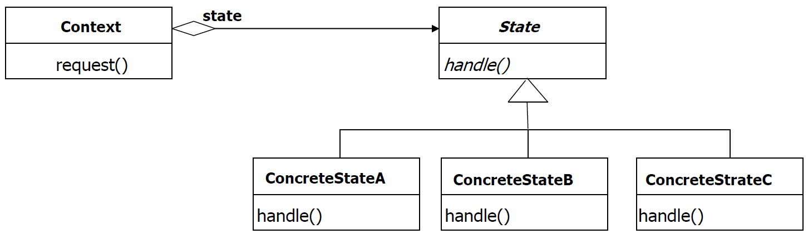
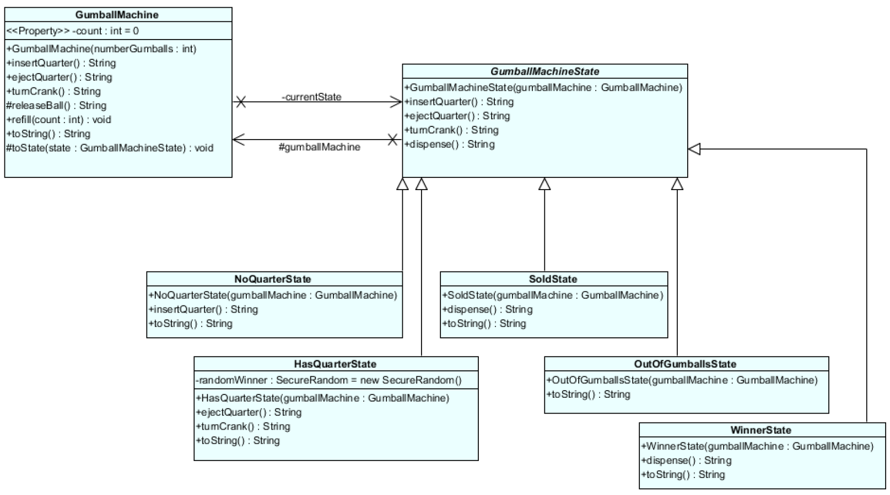

## [State Pattern](https://www.youtube.com/watch?v=N12L5D78MAA&list=PLrhzvIcii6GNjpARdnO4ueTUAVR9eMBpc&index=17)

### Wat is het?

Het state pattern is een gedragspatroon. Het is een patroon dat de interne state van een object verandert. Het object zal gedrag vertonen dat afhankelijk is van de state waarin het zich bevindt. Het state pattern is een alternatief voor het gebruik van if-else statements..

"Het State Pattern maakt het voor een object mogelijk zijn gedrag te veranderen wanneer zijn interne toestand verandert. Het object lijkt van klasse te veranderen."

### Voorbeeld

Een voorbeeld van een state pattern is een automaat. Een automaat kan verschillende states hebben. Bijvoorbeeld: geen geld, wel geld, koffie aan het maken, koffie klaar. De automaat zal gedrag vertonen dat afhankelijk is van de state waarin hij zich bevindt. Je kan geen koffie maken als er al een andere koffie wordt gemaakt enzovoort. Dit willen we oplossen met het state pattern.

### Oplossing - Algemeen

1.  Maak een context klasse die states nodig heeft. Deze klasse zal de state bijhouden en de state methodes aanroepen.
    - bijvoorbeeld: KoffieAutomaat
2.  Maak een abstracte state klasse. Deze klasse zal de methodes bevatten die de context klasse nodig heeft. Deze methodes zullen de state veranderen.
    - bijvoorbeeld: AutomaatState
3.  Maak een/meerdere concrete state klasse voor elke state die de context klasse kan hebben. Deze klasse zal de methodes van de abstracte state klasse implementeren. Deze methodes zullen de huidige state veranderen als dat nodig is.
    - bijvoorbeeld: GeenMuntState, MuntState, KoffieMakenState, KoffieKlaarState



> Je moet state diagram kunnen opstellen
> 

### Voorbeeld Vervolg

> stappen komen overeen met de stappen in de algemene oplossing

1.  ```java
    public class KoffieAutomaat {
          private AutomaatState state;

          public KoffieAutomaat() {
                state = new GeenGeldState(this);
          }

          public void setState(AutomaatState state) {
                this.state = state;
          }

          public void insertCoin() {
                state.insertCoin();
          }

          public void pushButton() {
                state.pushButton();
          }

          public void takeCup() {
                state.takeCup();
          }
    }
    ```

2.  ```java
      public abstract class AutomaatState {
            protected KoffieAutomaat automaat;

            public AutomaatState(KoffieAutomaat automaat) {
                  this.automaat = automaat;
            }

            public abstract void insertCoin();
            public abstract void pushButton();
            public abstract void takeCup();
      }
    ```

3.  ```java
      public class GeenGeldState extends AutomaatState {
            public GeenGeldState(KoffieAutomaat automaat) {
                  super(automaat);
            }

            @Override
            public void insertCoin() {
                  System.out.println("
                  Geld is ingevoerd");
                  automaat.setState(new GeldState(automaat));
            }

            @Override
            public void pushButton() {
                  System.out.println("Geen geld ingevoerd");
            }

            @Override
            public void takeCup() {
                  System.out.println("Geen geld ingevoerd");
            }
      }
    ```

    ```java
       public class GeldState extends AutomaatState {
       public GeldState(KoffieAutomaat automaat) {
       super(automaat);
       }

                @Override
                public void insertCoin() {
                      System.out.println("Geld is al ingevoerd");
                }

                @Override
                public void pushButton() {
                      System.out.println("Koffie wordt gemaakt");
                      automaat.setState(new KoffieMakenState(automaat));
                }

                @Override
                public void takeCup() {
                      System.out.println("Koffie is nog niet klaar");
                }

       }

    ```

    ```java
    public class KoffieMakenState extends AutomaatState {
      public KoffieMakenState(KoffieAutomaat automaat) {
         super(automaat);
      }

      @Override
      public void insertCoin() {
         System.out.println("Koffie wordt reeds gemaakt");
      }

      @Override
      public void pushButton() {
         System.out.println("Koffie wordt gemaakt");
         automaat.setState(new KoffieKlaarState(automaat));
      }

      @Override
      public void takeCup() {
         System.out.println("Koffie wordt gemaakt wacht tot hij klaar is");
      }
    }
    ```

    ```java

    public class KoffieKlaarState extends AutomaatState {
      public KoffieKlaarState(KoffieAutomaat automaat) {
         super(automaat);
      }

      @Override
      public void insertCoin() {
         System.out.println("Koffie is klaar neem je geld terug");
      }

      @Override
      public void pushButton() {
         System.out.println("Koffie is klaar neem je geld terug");
      }

      @Override
      public void takeCup() {
         System.out.println("Koffie is klaar");
         automaat.setState(new GeenGeldState(automaat));
      }

    }

    ```

    ```java
    public class Main {
      public static void main(String[] args) {
         KoffieAutomaat automaat = new KoffieAutomaat();
         automaat.insertCoin();
         automaat.pushButton();
         automaat.takeCup();
      }
    }
    ```

> Andere UML zelfde principe
> 

# [TERUG NAAR INHOUDSOPGAVE](../README.md)
