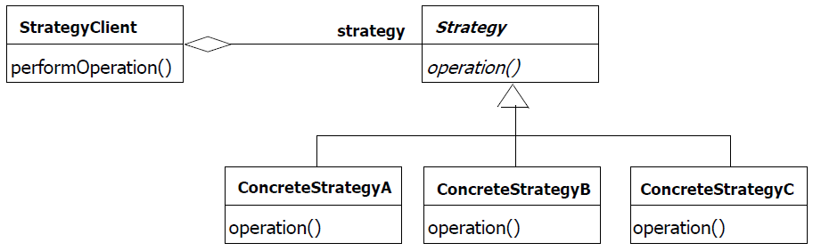
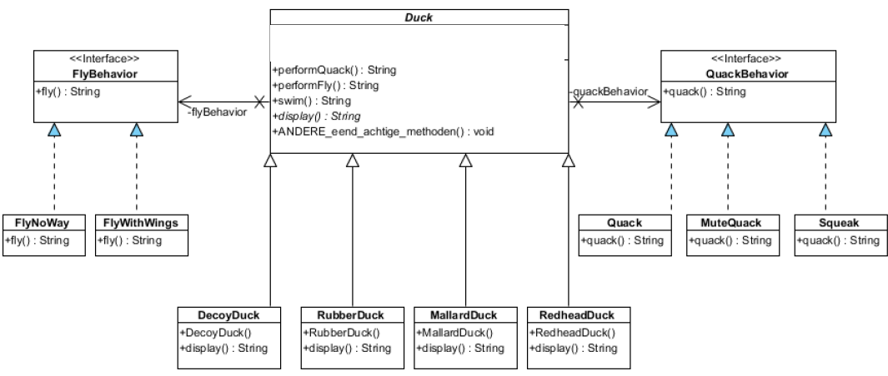

## [Strategy Pattern](https://youtu.be/v9ejT8FO-7I?list=PLrhzvIcii6GNjpARdnO4ueTUAVR9eMBpc)

### Probleem

We hebben een class die een bepaalde methode heeft. We willen de methode kunnen veranderen zonder de class te hoeven aanpassen. -> voor gevarieerd gedrag

### Voorbeeld

We hebben een class Duck die een methode quacken fly heeft. Maar er kunnen ook Duck's zijn die niet kunnen vliegen of niet kunnen kwaken. We willen de methode kunnen veranderen zonder de class Duck aan te hoeven passen.

### Oplosovereensing - Algemeen

1. We maken een interface met een bepaald gedrag (behaviour/strategy).
2. We maken een specifieke klasse (concrete behaviour/strategy) die het gedrag implementeert.
3. We maken een klasse (client) die het gedrag implementeerd.
4. Methode injectie van het specifieke gedrag in de klasse die het gedrag implementeerd. (constructor of setter)
5. Mogelijke subklassen maken van de klasse die het gedrag implementeerd.

   

### Voorbeeld Vervolg - Enkel vliegen

> stappen komen overeen met de stappen in de algemene oplossing

1. ```java
   public interface FlyBehaviour {
       public String fly();
   }
   ```

2. ```java
    //voor een duck die kan vliegen
   public class FlyWithWings implements FlyBehaviour {
        public String fly() {
             return "I'm flying";
        }
   }
   //voor een duck die niet kan vliegen
   public class FlyNoWay implements FlyBehaviour {
        public String fly() {
             return "I can't fly";
        }
    }
   ```

3. ```java
   public class Duck implements FlyBehaviour {
        private FlyBehaviour flyBehaviour;

    }

   ```

4. ```java
   public class Duck implements FlyBehaviour{
        private FlyBehaviour flyBehaviour;

        // met constructorinjectie -> kies 1 van de 2
        public Duck(FlyBehaviour flyBehaviour) {
            this.flyBehaviour = flyBehaviour;
        }

        // met setterinjectie
        public void setFlyBehaviour(FlyBehaviour flyBehaviour) {
            this.flyBehaviour = flyBehaviour;
        }

        //Gedrag implementeren
        public String fly() {
            return flyBehaviour.fly();
        }

    }

   ```

5. ```java
    public class MallardDuck extends Duck {
          public MallardDuck() {
                flyBehaviour = new FlyWithWings();
          }
    }

    public class RubberDuck extends Duck {
          public RubberDuck() {
                flyBehaviour = new FlyNoWay();
          }
    }
   ```

   
